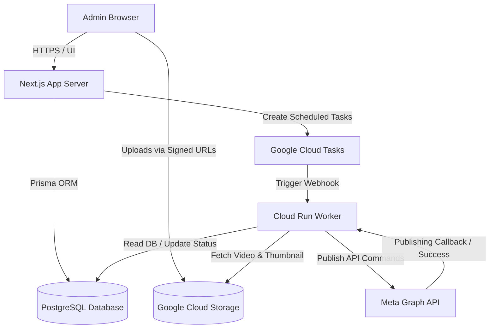

# Architecture Design: Facebook Multi-Page Publisher

This document describes the high-level system architecture, component breakdown, and data flow mechanisms for the Facebook Multi-Page Publisher.

---

## 1. System Overview

The system consists of a Next.js web application for administration, a PostgreSQL database, Google Cloud Storage for media assets, Google Cloud Tasks for execution queues, and a Google Cloud Run worker handling publisher logic.

---

## 2. Component Directory

### 2.1. Next.js Web App Dashboard (Next.js & Tailwind CSS)
- **Role**: Admin frontend and API backend.
- **Frontend**: Single-page administration dashboard styled with Tailwind CSS, utilizing React components for:
  - Account connection & Page synchronization status.
  - Video upload dropzones showing upload progress.
  - Form inputs for English titles, captions, hashtags, and thumbnails.
  - Schedule configuration (individual times or fixed-interval spacing).
  - Job monitor showing state (`DRAFT`, `SCHEDULED`, `PUBLISHING`, `PUBLISHED`, `FAILED`).
- **Backend (Next.js API Routes)**:
  - Exposes the Facebook Login OAuth callback receiver.
  - Provides REST endpoints to generate GCS pre-signed upload URLs.
  - Validates and stores metadata in PostgreSQL.
  - Invokes Google Cloud Tasks API to queue scheduled publishing jobs.
  - Provides dashboard read APIs to view jobs.

### 2.2. PostgreSQL Database & Prisma ORM
- **Role**: Persistent data storage.
- **ORM**: Prisma defines the database schema and handles migrations, querying, and schema safety.
- **PostgreSQL**: Relational storage for users, encrypted tokens, synced pages, and video scheduling metadata.

### 2.3. Google Cloud Storage (GCS)
- **Role**: Secure, scalable storage for uploaded media.
- **Configuration**:
  - Private bucket configuration (public access blocked).
  - Pre-signed URL endpoints allow the client browser to upload large video files and thumbnails directly, preventing server timeouts and minimizing Next.js server load.
  - Lifecycle policies are configured to clean up videos older than 30 days (or after verification of successful Facebook publication) to optimize storage costs.

### 2.4. Google Cloud Tasks
- **Role**: Cloud scheduling orchestrator.
- **Mechanism**:
  - Google Cloud Tasks provides custom scheduling ETA times.
  - When the user confirms a schedule, the Next.js API creates a new task in the Cloud Tasks queue, with the `scheduleTime` configured to the UTC date-time of execution.
  - The task payload references the unique database `VideoJobId`.
  - When the scheduled time arrives, Cloud Tasks dispatches an HTTP POST request to the worker endpoint.
  - Cloud Tasks handles automatic retries and exponential backoff, making it highly robust for scheduling without maintaining an active VPS.

### 2.5. Google Cloud Run (Publishing Worker)
- **Role**: Dedicated worker execution environment.
- **Execution**:
  - Next.js API endpoint or a separate lightweight Node.js service running on Google Cloud Run.
  - It receives the secure webhook POST request from Cloud Tasks.
  - Decrypts the Page Access Token.
  - Streams the video file directly from Google Cloud Storage to the Meta Graph / Reels Publishing API (utilizing chunked video uploads).
  - Inspects processing status from Meta API and updates the PostgreSQL database status to `PUBLISHED` or `FAILED`.

---

## 3. High-Level Data Flows

### 3.1. Facebook Authentication & Page Synchronization
1. Admin initiates login on Next.js frontend, forwarding to Meta's authorization URL.
2. Callback code is sent to the Next.js server.
3. Next.js server exchanges the authorization code for a User Access Token, then exchanges it for a **Long-Lived User Access Token**.
4. Next.js server queries Meta GET `/me/accounts` to fetch Page tokens.
5. Tokens are encrypted on the server using AES-256-GCM and stored in PostgreSQL.

### 3.2. Media Upload Flow
1. Client requests a signed GCS upload URL from the Next.js API.
2. Next.js server generates a short-lived PUT Signed URL.
3. Browser performs a direct HTTP PUT upload of the video to GCS, rendering progress bars.
4. Thumbnail selection is handled similarly.

### 3.3. Job Creation and Cloud Scheduling Flow
1. Admin sets scheduling times (in `Asia/Kolkata` time) and clicks "Publish".
2. Next.js server:
   - Converts the local times to UTC.
   - Saves a `VideoJob` record in PostgreSQL as `SCHEDULED`.
   - Creates a Google Cloud Task with a scheduled time (ETA) matching the UTC publish time.
   - Stores the generated Cloud Task reference ID in the `VideoJob` table (to allow for cancellations or updates).
3. The Admin can safely shut down their computer.

### 3.4. Background Execution Flow
1. Google Cloud Tasks triggers the Cloud Run worker endpoint.
2. Worker fetches the `VideoJob` record from PostgreSQL and marks status as `PUBLISHING`.
3. Worker retrieves the encrypted Page Access Token and decrypts it.
4. Worker executes Meta's chunked video/reel upload protocol:
   - **Start**: Initializes the upload session.
   - **Transfer**: Streams video binary chunks from GCS to Meta.
   - **Finish**: Confirms upload completion, providing metadata (English title, description, and custom thumbnail if applicable).
5. Once processed by Meta, the worker saves the Facebook Post/Reel ID and updates the database job status to `PUBLISHED`.
6. If an API failure occurs, standard retry logic is initiated by Cloud Tasks, or the status is set to `FAILED`.
