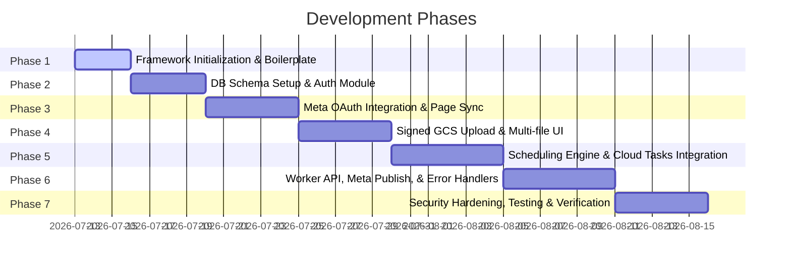

# Implementation Plan: Facebook Multi-Page Publisher

This document describes the step-by-step development phases, local setup instructions, testing steps, and deployment configuration for the Facebook Multi-Page Publisher.

---

## 1. Development Phases

### Phase 1: Framework Initialization & Boilerplate
- Initialize a new Next.js project with TypeScript inside the workspace folder using:
  `npx -y create-next-app@latest ./ --typescript --tailwind --app --src-dir --import-alias "@/*"`
- Install core development dependencies (e.g., Prisma, `@prisma/client`, Typescript bindings).
- Set up base layout and styling configuration in `globals.css` with a clean dark-themed dashboard design system.

### Phase 2: Database Schema & Authentication Module
- Initialize Prisma using `npx prisma init`.
- Add Postgres schema models (User, FacebookAccount, FacebookPage, VideoJob) to `schema.prisma`.
- Run migrations to instantiate tables in PostgreSQL database.
- Implement dashboard authentication (using NextAuth.js or custom Jose session tokens) for the Administrator account.
- Add AES-256-GCM encryption/decryption utilities for access tokens using Node's crypto library.

### Phase 3: Meta OAuth Login & Page Synchronization
- Register a Meta Developer Application (Type: Business or Consumer).
- Add App ID and App Secret into environment variables.
- Write the API OAuth endpoints to route the user back and forth to Meta Facebook Login.
- Exchange client auth codes for the Long-Lived User Access Token.
- Implement the page synchronization endpoint calling Graph API GET `/v20.0/me/accounts`.
- Encrypt and store verified Facebook Page Access Tokens.

### Phase 4: File Upload & Google Cloud Storage Integration
- Configure Google Cloud Storage bucket with private IAM access control.
- Write backend API routes to authorize and generate short-lived PUT pre-signed GCS URLs.
- Implement bulk-upload UI in Next.js using `xmlhttprequest` or `fetch` upload API.
- Display a progress bar for each file upload inside a grid layout.
- Bind uploaded objects to target files on GCS via UUID keys.

### Phase 5: Scheduling Engine & Cloud Tasks Configuration
- Implement job forms: metadata inputs (English title, caption, hashtags, target page) and scheduling parameters (individual time inputs or intervals).
- Add interval calculation module (adds offsets in UTC increments of N hours/minutes).
- Integrate `@google-cloud/tasks` SDK into Next.js.
- Implement Cloud Task generation: Create a Task referencing the worker webhook URL, with payload `VideoJobId` and ETA set to the calculated UTC schedule time.
- Implement Task cancellation (for deleting or editing schedules) using saved Task IDs in DB.

### Phase 6: Worker Webhook & Meta Video Publishing API
- Implement the secure API POST endpoint (Publishing Worker) inside Next.js or Google Cloud Run.
- Configure verification headers to validate incoming tasks from Google Cloud Tasks.
- Decrypt target Page Access Tokens on the fly.
- Implement resumable/chunked video upload protocol to `/v20.0/{page_id}/videos` or `/v20.0/{page_id}/video_reels`.
- Set up thumbnail assignment configuration via `thumb` parameters or upload payloads.
- Update PostgreSQL database status based on execution status results.

### Phase 7: Security Hardening, Testing, and Verification
- Set up Winston or standard logs sanitization wrapper to strip all token strings.
- Complete comprehensive integration testing using mock Meta responses.
- Implement validation checks checking inputs against English-only character structures.
- Deploy testing staging builds to verify webhook triggers from Cloud Tasks.

---

## 2. Verification Plan

### 2.1. Automated Unit & Integration Tests
- **Encryption Test**: Verify that AES-256-GCM functions correctly encrypt and decrypt sample strings. Assert that identical data encrypted twice produces different ciphertexts (via random IVs).
- **Validation Test**: Write test cases with regular expressions to ensure inputs containing non-English character blocks are rejected.
- **Queue Test**: Mock the Cloud Tasks SDK to verify that schedule creation requests contain the correct payload parameters, headers, and UTC timestamps.

### 2.2. Manual E2E Testing
- **Local Sandbox Verification**:
  1. Spin up PostgreSQL locally.
  2. Use Meta Developer Sandbox Test Users to trigger Facebook Login.
  3. Verify token exchange, database storage, and encryption of tokens.
  4. Perform bulk uploads of mock `.mp4` video files to local storage mock or GCP Staging Bucket.
  5. Schedule one video to publish in 5 minutes. Verify that the time saved is in UTC.
  6. Check the UI dashboard list: the schedule time must be displayed in `Asia/Kolkata` time.
  7. Wait for the background worker to execute. Check database records to see status update (`SCHEDULED` -> `PUBLISHING` -> `PUBLISHED`).
  8. Inspect the Sandbox Test Facebook Page and check if the post contains the correct English title, caption, and thumbnail image.

- **Error Simulation Verification**:
  1. Trigger user logout/de-authorization on Facebook to expire the Page access token.
  2. Run a scheduled task. Ensure the worker logs an API error code `190`, fails gracefully, logs `FAILED` in the database with standard details, and triggers a reconnection warning on the dashboard interface.
